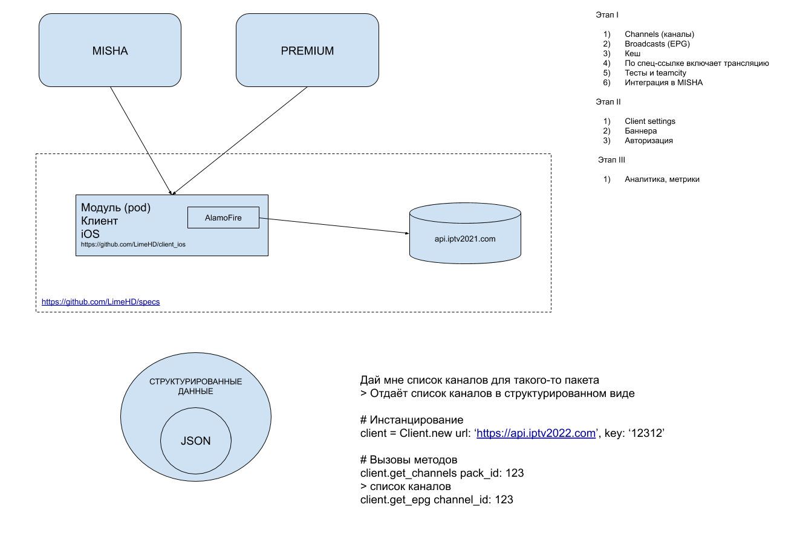

# Внутренние спецификации Lime HD

[Принципиальная схема](https://docs.google.com/drawings/d/1W44GGFUHpDV_HZ6XtfzGzekCp00aCmDeNcFYRQP8hpQ/edit?usp=sharing)

## Принципы

* Явная передача параметров в запросе.
* В запросе указывается ожидаемый тип контента `Accept` и `Accept-Language`
* `User-Agent` не переопредялется.

## Заголовки запроса

Все запросы на внутреннее API совершаются со следующими  HTTP-заголоками:

Обязательные:

* `X-Platform` – наименование платформы. 'ios' или 'android'.
* `X-Device-Name` – наименование устройства (до 40 символов), например "HONOR+AUM-L29".
* `X-Device-Id` – идентификатор устройства (до 40 символов), например "2a2849ec114c2ede".
* `X-App-Id` – идентификатор приложения из маркета, например "limehd.ru.lite".
* `X-App-Version` – версия приложения по снатнадру Semantic Versioning

Желательные:

* `X-Android-Sdk` – номер версии Android SDK которой собрано приложение, например "28". Не обязательный.

## Заголовки от сервера

* `X-Server-Addr` – адрес сервера, отработавшего запрос.
* `X-Server-Name` – доменное имя сервера, отработавшего запрос.
* `X-Request-Id` – уникальный идентификатор запроса.
* `X-Request-Time` – время обработки запроса.

# Получение ссылки для стриминга (m3u8-плейлист)

Ссылка формируется следующим образом:

`{API_URL}/v1/streams/{STREAM_ID}/redirect`

Пример: https://api.iptv2021.com/v1/streams/114/redirect

Документация: https://api.iptv2021.com/#!/streams/getV1StreamsIdRedirect

# Кеширование

1. Плейлист
2. Программа

# Авторизация

* 1. Приватные HTTPS
* 2. Cookies
* 3. Access Token

## Стандарты

При разработке клиента придерживаемся следующих стандартов и принципов

* HTTP 1.1
  * [RFC7230](https://tools.ietf.org/html/rfc7230)
  * [RFC7231](https://tools.ietf.org/html/rfc7231)
  * [RFC7232](https://tools.ietf.org/html/rfc7232)
  * [RFC7233](https://tools.ietf.org/html/rfc7233)
  * [RFC7234](https://tools.ietf.org/html/rfc7234)
  * [RFC7235](https://tools.ietf.org/html/rfc7235)
* [REST](https://en.wikipedia.org/wiki/Representational_state_transfer)
* [JSON:API v1.0](https://jsonapi.org)
* [Semantic Versioning 2.0.0](https://semver.org)
* [RFC3339](https://tools.ietf.org/html/rfc3339)
